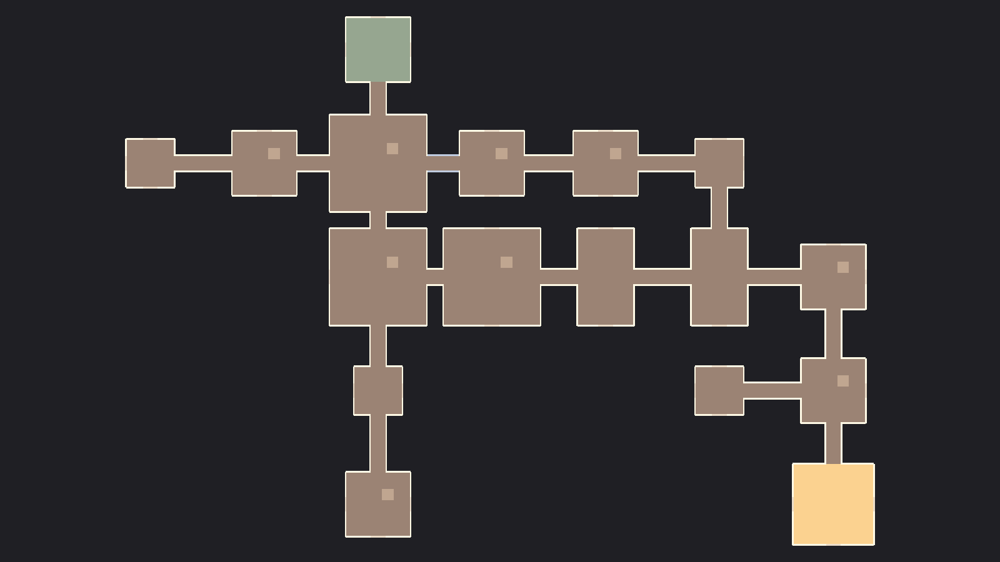

# 고양이 62 — 생성기 v2: 격자 그래프 "벽 속" (2026-09-24, docs/10 v2, 새 루프 1단계)

## 목표
맵 시안처럼 출발방 → 주 경로 → 목적지방, 곁가지 막다른 방, 고리(파이프) 1개. 사용자 결정 "생성기가 이런 모양을 만들게".

## 설계
- `World/GridRoom`(NetworkBehaviour): 크기, 면별 문 자리·막음벽, `OpenSides` NV(비트) → 스폰 때 막음벽 끄기(호스트·클라 같게). 스폰 표시(전리품·함정·숨을 곳·어둠·고양이·쥐 시작)는 RoomModule과 같은 이름으로.
- `World/GridCorridor`: 바닥+양벽, 길이·폭은 루트 스케일(스폰 때 스케일 동기화). 파이프는 폭 1.2.
- `Run/GridLayoutPlanner`(순수 C#, 시드 → 칸 그래프): 주 경로 걸음, 곁가지, 고리 후보. 유니티 없이 돌아서 스트레스가 빠르다.
- `Run/GridZoneBuilder`: 플래너 결과로 방·통로 배치·스폰 → NavMesh → 기존 스폰 로직(ZoneBuilder와 공유할 부분은 뽑아 씀).
- `Data/GridZoneSO`(테마): 방 풀(크기별), 출발·목적지 방, 통로·파이프 프리팹, 수치 4개.
- 에디터: `Tools/RatGame/Zone/Create Wall Rooms`(벽 속 테마 방 킷), `Create Wall Stage`(씬 `Stage_Walls`), 스트레스 테스트.

## 단계 (각각 확인하고 다음)
1. 플래너 + 스트레스(칸 그래프만): 주 경로·곁가지·고리 통계.
2. 방 킷·통로 프리팹 + 에디터 배치 미리보기(씬에 한 판 깔기).
3. 네트워크 스폰·NavMesh·스폰 로직 → 플레이 → 2인.

## 사용자 확인 (체크리스트 U-60대)
- 한 판 위에서 본 모습(시안과 비교), 출발 → 목적지 두 길, 막다른 방.

## 1단계 결과 — 칸 그래프 플래너 (2026-09-24)
- `Run/GridLayoutPlanner`(순수 C#) + `Editor/GridZoneTools`(`Tools/RatGame/Zone/Grid Plan Stress (200 seeds)`).
- 주 경로: 출발에서 멀어지는 쪽 가중 3배 자기 회피 걸음, 막히면 다시(최대 30번 — 실제 1번이면 됨). 곁가지 0.6 확률·깊이 1~2. 고리: 이웃인데 안 이어진 쌍(순번 차 ≥3) → 없으면 빈 칸 1~3개 샛길을 내서 파이프로 닫기. 마지막에 연결 수로 곁가지/막다른 방 역할 재계산.
- 처음엔 고리가 35%뿐 → 샛길 추가 후 92%.

| 시드 | 실패 | 고리 | 방 수 | 막다른 방 | 목적지 거리 | 이웃 아닌 연결 | 출발방 문 ≠1 | 시간 |
|---|---|---|---|---|---|---|---|---|
| 200 | 0 | 184 | 14.5 (9~21) | 3.0 | 6.7칸 | 0 | 0 | 15ms |
| 2000 | 0 | 1866 | 14.5 (8~23) | 3.0 | 6.6칸 | 0 | 0 | 72ms |

예 (시드 1000, S 출발 D 목적지 M 주 경로 b 곁가지 x 막다른 방, `=` 파이프):
```
D-M-b=b
  |   |
x-M-M b
    | |
  x-M-M
      |
      S
```

## 2단계 결과 — 방 킷·배치·미리보기 (2026-09-24)
- `World/GridRoom`(막음벽 4개 + `OpenSides` NV, RoomModule과 같이 붙음), `Data/GridZoneSO`(Zone_Walls), `Run/GridZoneLayout`(칸 → 방 배치, 이웃 문 사이 통로 = 루트 Z 스케일).
- `Tools/RatGame/Zone/Create Wall Rooms`: 출발(8×8, PlayerSpawn 4)·목적지(10×10, Depot 자리)·소 6×6·중 8×8·가로 12×7·세로 7×12·대 12×12 + 통로·파이프. 방마다 전리품(면적/10)·함정 1~2·숨을 곳 1~2(모서리)·어둠 자리·고양이 자리·고양이 스팟. 벽 속 색(나무 바닥·회반죽 벽, 파이프는 회색).
- `Tools/RatGame/Zone/Preview Wall Layout (seed 1000)`: 임시 씬에 깔고 겹침·NavMesh·위에서 본 그림.
- 버그 1: 방 종류 기본값이 "출발"이라 보통 방이 전부 출발방처럼 만들어짐(바닥 초록·전리품 대신 출발 자리) → 기본값을 보통으로.

| 시드 | 방 | 통로 | 고리 | 방 겹침 | 출발→목적지 | 못 가는 방 |
|---|---|---|---|---|---|---|
| 1000 | 12 | 12 | 1 | 0 | OK | 0 |
| 1001 | 17 | 17 | 1 | 0 | OK | 0 |

 — 위 초록 = 출발, 오른쪽 아래 주황 = 목적지(상점·창고), 옅은 회색 통로 = 파이프.

## 3단계 결과 — 네트워크 스테이지 (2026-09-24)
- `Run/GridZoneBuilder`, `Run/ZonePopulator`(ZoneBuilder에서 분리 — 부엌 242줄 → 95줄), `Tools/RatGame/Zone/Create Wall Stage`(Stage_Walls + 빌드 목록 + 기지 게시판 3번째 목적지 "벽 속(생성)").
- 식량 창고(쥐구멍 존 프리팹)를 **목적지방 Depot**에 → 지금 귀환 판정이 곧 "목적지 도착으로 끝내기"(새 루프 도착 부분).
- 찾은 것 ①: 쥐가 출발방에서 벽을 보고 시작 → 문 쪽으로 돌렸는데도 안 돎. 1인칭 시선(PlayerCameraRig._yaw)이 몸 방향을 정해서 텔레포트 회전이 덮어써짐 → `FaceClientRpc`(배치·개발 메뉴 이동 때만 — 매 프레임 텔레포트(다운 몸·물고 가기)엔 안 씀). 개발 메뉴 "가기"도 이제 대상을 봄.
- 찾은 것 ②(테스트 절차): 호스트가 뜨는 중에 클라를 띄우면 **플레이어 없는 유령 연결(client 1)**이 목록에 남아 스테이지 로드 완료 이벤트가 안 옴 → 출발·맵 생성이 멈춤. 호스트 "자동 호스트 성공" 뒤에 띄우면 정상. 실제 플레이에서 접속 승인 중 끊긴 사람이 있으면 같은 일이 날 수 있음 → 후보로 남김(로드 완료 대기에 시간 제한·유령 연결 정리).

| 확인 | 결과 |
|---|---|
| 1인 직접 플레이 | 방 12·통로 12·고리·전리품 56(2046)·함정 10·숨을 곳 11·어둠 5·고양이 1, 쥐 출발방, 출발→목적지 경로 79m, 막음벽 닫힘 24/열림 24(=연결×2) |
| 흐름 | 출발 → 목적지 창고로 → Returning → Returned(3s) → 기지 |
| 2인(기지 출발) | 클라 NetworkObject 109/109, 방 12/12 열린 면 값, 두 쥐 출발방 1.5·0.5m·문(동) 쪽 오차 0°, 목적지 → 기지, 호스트·클라 예외 0 |
